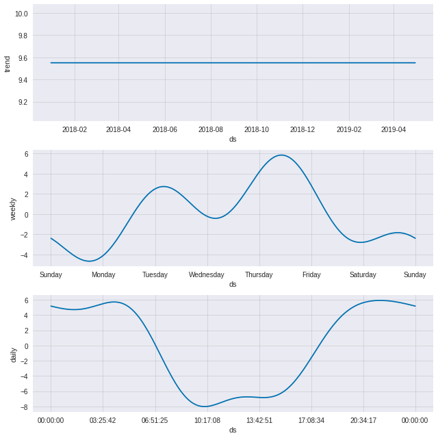

# Taking off the Training Wheels: Re-balancing the Citibike System

**Author**: Mitchell Krieger


***

## Overview

Citibike and other similar bike sharing systems face a unique challenge in balancing their system. Bikes must be distrubted across all stations so that riders have access to both bikes to take out and empty docks to return bikes to. Unchecked, this challenge may cause bikes to pool in certain station and drain from others. This project attemps to understand which stations in the Citibike system are pools, drains or balanced. To do this, time series analysis was used to predict the number of bikes at a given station given the time and then based on their extracted daily seasonality from the time series model, classify stations as pools, drains or balanced.

## Bussiness Understanding

Bike-sharing systems have a specific challenge when it comes to a user’s experience: bike stations can’t be empty because then riders will have no bike to take out. However, bike stations also shouldn’t be full because then riders will have no place to dock a bike. This dichotomy takes on additional complexity when you factor in things like the direction of rider traffic flow, time of day, weather, and hills. These elements among other user habits often will cause a Bike-share system to become “unbalanced”. The two indicators of an unbalanced system are:

- Bike Drains: Riders will take bikes out of certain areas but not return them on their commute back causing a scarcity of bikes and empty stations (Possible example causes: stations on top of hills/in a hilly area, Residential areas during the morning commute, etc)
- Bike Pools: Riders will deposit bikes but not take them out causing an abundance of bikes and no docks (Possible example causes: stations far from other modes of transit, sun setting before end of the workday)

When a system is unbalanced, the drains and pools make finding/returning a bike impossible and disrupt the user experience. Therefore the balancing of the system is a critical task for CitiBike and other bike-share systems to manage on an hourly basis. Forcasting where and when bikes are going to be needed will be important order to effectively balance the. AI and Machine Learning can be used to predict where the demand for bikes will be and thus help identify where re-balancing methods need to focus their efforts. This project uses multivariate time-series anlysis to forcast bike demand and then un-supervised classification to identify bikes as pools, drains or balanced.

## Data

Live feed station data and trip history is available through [CitiBike’s open system data](https://www.citibikenyc.com/system-data). In addition, historical timestamped station data through April 2019 was collected from [The Open Bus project](https://www.theopenbus.com/methodology.html). Stations and bikes have a unique id that allows the joining of information between datasets. The project will focus on data from 2018, as the 2019 data is somewhat incomplete. Live data was collected over a two and a half week period in November/December 2020. A `Station` class was created for quick access to features and analysis of various station information. 

Betweem 2018 and 2020, there has been a large increase in stations and some stations have been discontinued:


As a result, some stations have missing data due to their installation later in 2018 and/or due to issues in data collection (weather obstructions, equipment malfunction etc.) either because of open bus or citibike. Missing data was not imputed or dropped until later because different modeling techiniques required different approaches to null values (ex. Facbook Prophet can handle missing values, where as SARIMA cannot).

## Methods

To help solve the citibike system rebalancing issue, this project uses various methods of time series modeling and analysis (SARIMA, Facebook Prophet, RNN/LSTM) in python to predict how many bikes are at a given station at a given time. Once time series forcasting models were created the daily seasonality was extracted in order to use clustering to classify stations as pools, drains or balanced. 

## Exploratory Data Analysis

### Visualizing Pools & Drains

Because seasonality will be such a critical part of this project, visualizing how bike availability changes hourly, daily, weekly and monthly helps us understand the what seasonality will need to be captured by the modeling process. This animation demonstates a typical week day pattern (the a full interactive animation can be found by downloading `percent_full_map.hmtl` from the `images/` directory):


Here you can see pooling in some areas identified by consistent large red bubbles (ex. Red Hook, Brooklyn) and draining from other areas identified by consistent small blue dots (ex. Spanish Harlem, Manhattan). In addition, the graphic demonstrates a typical daily seasonality: there is a major shift in the system around commuting hours from bike stations in residential districts to/from stations in business districts. 

### Vizualizing Seasonality

The trend in the animated map above points to the system's seasonality. The following heatmap of total number of trips during a given hour on a given day and the line plot comparing the average number of trips on weekends to weekdays, highlight the the key properties of the system's seasonality:

<p float="center">
  
   
</p>

Clear spikes occur during commuting hours on weekdays, while on weekends there is less of a high concentration of useage at one time. You can also see that of the weekdays, Tuesday, Wednesday and Thursday are have slightly higher useage than Monday and Friday. These are clear weekly and daily seasons. However, any yearly seasonality is not apparent in the above. The following plots look at the number of rides monthly vs daily in 2018.


While there is a clear difference when months are aggregated between the seasons, the daily plot shows us that the difference isn't quite as stark as one might initially think. This is perhaps due to the vast swings in temperature and weather in New York in recent years. This means if there is yearly seasonality, it may be a weaker factor in the models than daily and weekly.

### Visualizing Rider Behavior

Additionally, riders have a time limit of 30 minutes on a single ride pass, and 45 minutes on a membership. This means that pools and drains can be created if stations are too far apart. However, the vast majority of riders don't even get close the the ride time limit:


So stations that are further than 20+ minutes away from multiple other stations (mostly would occur on the geographic edges of the system) could be at risk of draining or pooling. However, one way to avoid this is when citibike stations are placed next to other transit hubs to help riders commute their last leg. In fact the top 25 busiest stations were mostly located near transit hubs like Grand Central, Penn Station, Union Square, PATH stations, Columbus Circle:


This not only helps balance the system by introducing new riders who live outside the city or deep in the outer bouroughs, it also helps riders avoid the extra rail cost of using the subway for the last leg of their trip.

## Results

### Modeling

Out of many forcasts run via grid search and cross validation on SARIMA, Facebook Prophet and RNN/LSTM models, the best model was Facebook Prophet:

|       Model      | Best Parameters                                                        | RMSE  | MAE  | AIC      | Seasonality detected            |
|:----------------:|------------------------------------------------------------------------|-------|------|----------|---------------------------------|
| ARIMA (Baseline) | p=0, d=0,q=0,                                                          | 8.97  | 8.05 | 2348.227 | None                            |
| SARIMA           | (p=1,d=0,q=1) x (p=0,d=2,q=2,s=24)                                     | 9.71  | 7.77 | 1281.794 | Daily                           |
| Facebook Prophet | daily = 3 Fourier terms, scale: 10 weekly = 4 Fourier terms, scale: 10 | 6.30  | 5.15 | N/A      | Daily, Weekly, (yearly in some) |
| RNN/LSTM         | layers=3, dropout=.4, batch_size=16, hidden_size = 25, epochs = 400    | 11.65 | 9.19 | N/A      | Daily, (Weekly incorrectly)     |

The Facebook Prophet model demonstrated the closest seasonality to the actual numbers and had the best performance metrics by far. We can also see that the when plotting the confidence intervals, most datapoints fall within the confidence interval even when the predicted value does not quite capture the what is happing in reality:


The facebook prophet model also has the ability to easily handle the entire year and malfunctioning stations (thus missing data), therefore it will be the a convient model to choose to cluster on. This particular model also demonstrates the seaonality of the system well when decomposed. As this sample station is a residential neighborhood, we see more bike at the station in the evening and less bikes during the day. We can also see from the same Tuesday/Wednesday/Thursday spike in the weekly seasonality as we did in our EDA:



### Clustering

Balanced stations should begin and end in the same place, and centered around zero. If the end points are non-zero the remainder of the day should balance out the ends. For example, a U shape like are often found in residential neighborhoods. This shape is balanced because it returns to where it started. Similary an inverted U often ofound in business areas, are also balanced because they return to where they started. The station is on right is on the upper west side and the station on the left is in the financial district:

<p float="center">
  
   
</p>

Unbalanced stations take on an upward or downward trend or are not centered around zero. This station in red hook is a bike pool:


Using clustering we can classify like stations and then identify the cluster's quality.

## Conclusions

Facebook Prophet clearly has the best metrics on both the train and test set as well as most closely demonstrating the weekly and daily seasonality present in the citibike system. In addition because of its ability to easily handle missing data, it performed almost as well when cross validated throughout the year with a horizon of 22-23 days. This possibly indicates that adding yearly seasonality may only marginally increase the performance of the model. Now that we can use the model to somewhat accurately predict the number of bikes at a given station, we can extract the daily seasonality of the model to classify stations as pools, drains or balanced via clustering.

Citibike can use these models to select stations to take bikes from due to an abundance of bikes and redistribute them to stations in need of more bikes. Citibike should also think about how to use seasonality to its advantage when rebalancing the system. Bikes tend to freeze in place overnight (as seen in EDA), which may be a good time for redistribution and because large spike during rush hour is consitently seasonal, it may be advantageous to attempt to redistribute bikes during the after the morning commute during business hours to business areas in anticipation of the evening commute rush. Citibike should also consider establishing new stations in areas with many drains/pools.

## Next Steps

Next steps are to:

- Further tune models (and maybe try new ones)
- Cluster stations into pools, drains and balanced
- Incorporate Exgoneous Variables such as holidays, weather, electric bikes and elevation
- Make interactive dashboard via dash, bokeh or tableau
 
## Repository Structure

```
├── images              <- directory containing image files and plots used in project and animated hmtl maps 
├── scratch_notebooks   <- old jupyternotebooks used in workflow
├── 01_exploratory_data_analysis.ipynb <- Narrative Jupyter Notebook containing Visualizations and Other EDA
├── 02_modeling.ipynb   <- Narrative Jupyter Notebook containing modeling processes
├── README.md           <- README for overview of this project
├── bikecron.py         <- py script used to regularly collect live feed data using cron locally
├── presentation.pdf    <- a PDF version of the power point presentation
├── cleaning.py         <- py script that cleans data and creates pickled files
├── evaluation.py       <- py script containing functions for evaluation
├── hidden_printing.py  <- py script that temporaryily suppressed printing function
└── station.py          <- py scrip that contains functions for station analysis and the Station class
